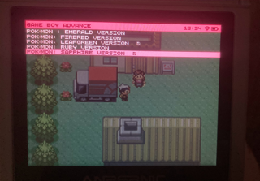
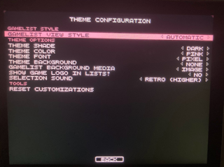
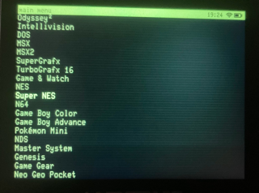
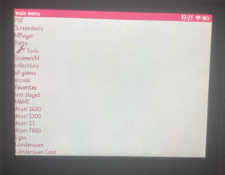

# es-theme-minielec
a minimalistic theme for small screens, for amberelec and batocera, inspired by MiniUI (https://github.com/shauninman/MiniUI) for miyoo mini!

there was a lack of super-simple list based themes for emulationstation, so i made one! this theme is designed to get out of your way, let you focus on picking a game to play, and then just get to playing. it does away with descriptions, ratings, and any other extra fluff that might distract you from picking a game. 

works best on Anbernic rg351v and other 4:3 devices, hasnt been tested on 16:9 setups

please set the list transition style to instant for this theme to look as intended!

you can have game screenshots or game videos as the background for the game lists if you want. but you can also turn that off, for a super clean look!

you can also add a custom background. just replace custombg.png with whatever you want! then set the background setting to custom

